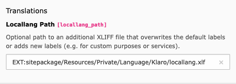
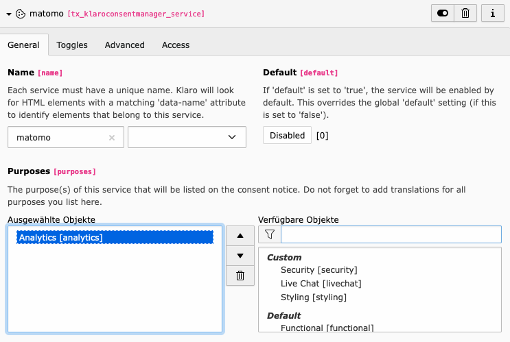
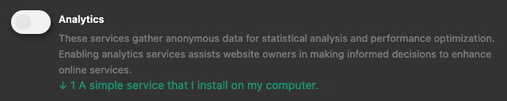

# Klaro Consent Manager

TYPO3 integration of Klaro! Consent Management. Klaro! is a powerful tool that protects the privacy and data of your visitors and helps you run a GDPR compliant website.

## Add custom purposes

### Create custom XLIFF file(s)

```
EXT:sitepackage/Resources/Private/Language/Klaro/locallang.xlf
```

### Add new Keys for purposes

```xml
<trans-unit id="purposes.analytics.title">
    <source>Analytics</source>
</trans-unit>
<trans-unit id="purposes.analytics.description">
    <source>These services gather anonymous data for statistical analysis and performance optimization. Enabling analytics services assists website owners in making informed decisions to enhance online services.</source>
</trans-unit>
<trans-unit id="purposes.security.title">
    <source>Security</source>
</trans-unit>
<trans-unit id="purposes.security.description">
    <source>Security services are crucial for safeguarding your online experience. These services help protect your data and privacy by detecting and preventing security threats, such as malware, phishing attempts, and unauthorized access. They ensure a safer browsing environment.</source>
</trans-unit>
<trans-unit id="purposes.livechat.title">
    <source>Live Chat</source>
</trans-unit>
<trans-unit id="purposes.livechat.description">
    <source>Live chat services enable real-time communication with website support teams. They offer a convenient way to ask questions, seek assistance, or engage in discussions while browsing a website. Live chat enhances your online interaction and customer support experience.</source>
</trans-unit>
<trans-unit id="purposes.styling.title">
    <source>Styling</source>
</trans-unit>
<trans-unit id="purposes.styling.description">
    <source>Services related to styling help to improve the appearance of the website. This can also have an impact on usability.</source>
</trans-unit>
```

The keys are structured according to the following scheme:

- Title of the Purpose: `purposes.<PURPOSE-IDENTIFIER>.title`
- Description of the Purpose: `purposes.<PURPOSE-IDENTIFIER>.description`

### Add reference in configuration record

Open the Klaro! configuration, go to `Display` → `Translations` → `Locallang Path` and enter the path to your newly created XLIFF file.



### Add new items with TSconfig
```
TCEFORM {
    tx_klaroconsentmanager_service.purposes.addItems {
        analytics = LLL:EXT:sitepackage/Resources/Private/Language/Klaro/locallang.xlf:purposes.analytics.title
        analytics.group = custom
    
        security = LLL:EXT:sitepackage/Resources/Private/Language/Klaro/locallang.xlf:purposes.security.title
        security.group = custom
    
        livechat = LLL:EXT:sitepackage/Resources/Private/Language/Klaro/locallang.xlf:purposes.livechat.title
        livechat.group = custom
    
        styling = LLL:EXT:sitepackage/Resources/Private/Language/Klaro/locallang.xlf:purposes.styling.title
        styling.group = custom
    }
    tx_klaroconsentmanager_configuration.purpose_order.addItems < .tx_klaroconsentmanager_service.purposes.addItems
}
```

### Finished!

Now you are able to select the new purposes in the configuration.



When a custom purpose is selected for a service, it is now also displayed in the frontend, including the description text.


