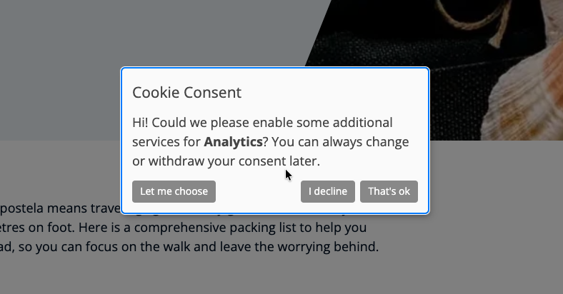
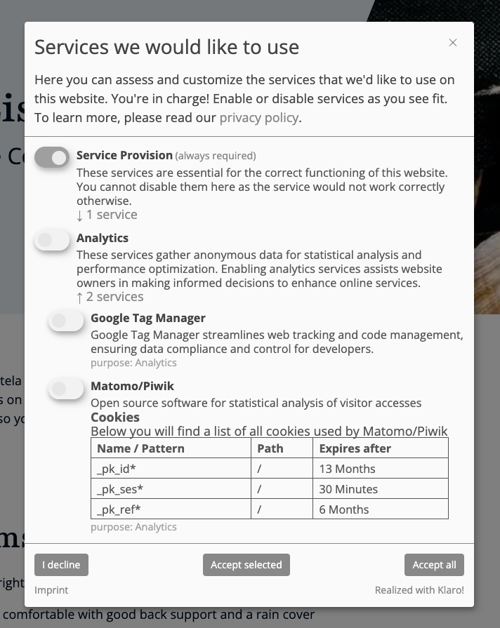

# Klaro! Consent Manager


| Meta          | Value                         |
| ------------- | ----------------------------- |
| Extension key | klaro_consent_manager         |
| Package name  | erhaweb/klaro-consent-manager |
| Version       | 2                             |
| Author        | Eric Harrer                   |

## What does it do?

This TYPO3 extension provides a functionally complete and feature rich, flexible TYPO3 integration of [Klaro! Consent Management](https://klaro.org/) (hereinafter referred to as "Klaro") by [KIProtect GmbH](https://kiprotect.com/), a powerful tool that protects your visitors' privacy and data and helps you run a GDPR compliant website.

Klaro itself is fully self-hosted and does not rely on the use of resources from external sources. It gives you full control over services requiring consent, including the cookies associated with them and the purposes they belong to. The styling can be influenced either via supplied (also colour-neutral) schemes or your own CSS.

If you have already worked with Klaro in TYPO3, you will love this extension because it is much more intuitive to use due to the use of the backend GUI. If not, this extension will make it particularly easy for you to familiarise yourself with Klaro's range of functions.

## Screenshots






## Further details

For detailed information, please visit the [official documentation in the TYPO3 extension repository (TER)](https://docs.typo3.org/p/erhaweb/klaro-consent-manager/main/en-us/).

<!-- ter-integration:start -->

## Release automation

Publishing to TER is automated with `.github/workflows/publish-ter.yml` and the
official TYPO3 Tailor CLI.

### Required repository secret

Add the repository secret `TYPO3_API_TOKEN` with the scopes
`extension:read,extension:write` and restrict it to `klaro_consent_manager`.

### Standard release flow

1. Create the release commit and tag it as `x.y.z` without a `v` prefix.
2. Push the commit and tag to GitHub.
3. The workflow checks out the tagged commit, validates the version markers in
   `ext_emconf.php` and `Documentation/guides.xml`, generates the TER upload
   comment from the non-merge commit subjects since the previous release tag,
   builds the TER artefact, verifies its contents, and publishes the package to
   TER.

### Manual backfill for an existing tag

If a tag already exists and has not been published yet, start the workflow
manually from `main` and provide the tag name in the `version` input.

With the GitHub CLI this looks like:

```bash
gh workflow run publish-ter.yml --ref main -f version=2.3.1
```

Only one workflow run per release version is allowed at a time. Parallel runs
for the same tag are serialized by the workflow `concurrency` group.

### Manual dry run for an existing tag

To validate packaging without contacting TER, start the same workflow manually
and set `dry_run=true`. The workflow then creates the TER artefact zip, uploads
it as a GitHub Actions artefact, and skips token validation and publication.

With the GitHub CLI this looks like:

```bash
gh workflow run publish-ter.yml --ref main -f version=2.3.1 -f dry_run=true
```

### Local dry run

The helper script validates the current release tag and generates the TER
comment locally:

```bash
bash Build/Scripts/prepareTerPublish.sh 2.3.1
```

To create and verify a local TER artefact with Tailor, install the pinned
version and use the packaging exclusions from
`Build/Tailor/ExcludeFromPackaging.php`:

```bash
COMPOSER_HOME="${PWD}/.Build/.composer" composer global require typo3/tailor:1.7.0
TYPO3_EXCLUDE_FROM_PACKAGING=Build/Tailor/ExcludeFromPackaging.php \
  php .Build/.composer/vendor/bin/tailor create-artefact 2.3.1 klaro_consent_manager --path=.
bash Build/Scripts/verifyTerArtefact.sh tailor-version-artefact/klaro_consent_manager_2.3.1.zip
```

<!-- ter-integration:end -->
