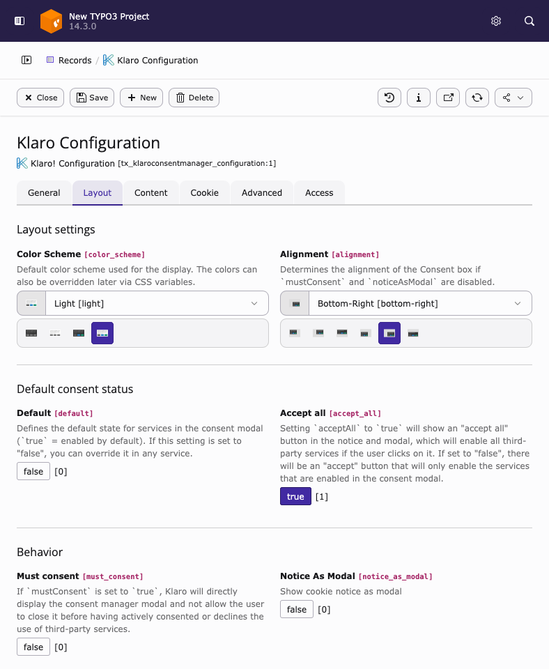
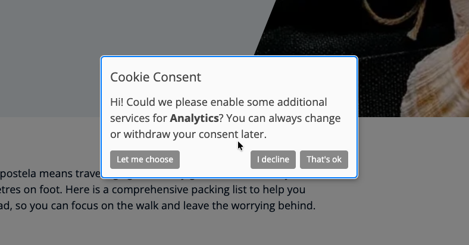

# Klaro! Consent Manager

[](https://github.com/ErHaWeb/klaro_consent_manager/actions/workflows/ci.yml)
[](https://packagist.org/packages/erhaweb/klaro-consent-manager)
[](LICENSE)
[](https://docs.typo3.org/p/erhaweb/klaro-consent-manager/main/en-us/Compatibility/)

Klaro! Consent Manager provides a self-hosted TYPO3 integration of
[Klaro! Consent Management](https://klaro.org/) by
[KIProtect GmbH](https://kiprotect.com/). It helps you run a GDPR-oriented
consent setup while keeping the configuration inside TYPO3.

Instead of maintaining a hand-written Klaro `config.js`, editors and
integrators can manage services, cookies, labels, styling, and contextual
consent through TYPO3 backend records and configuration.

## At a glance

| Item | Value |
|------|-------|
| Extension key | `klaro_consent_manager` |
| Composer package | [`erhaweb/klaro-consent-manager`](https://packagist.org/packages/erhaweb/klaro-consent-manager) |
| TYPO3 support | <code>^13.4 &#124;&#124; ^14.3</code> |
| PHP support | `>=8.2 <8.6` |
| Documentation | [docs.typo3.org](https://docs.typo3.org/p/erhaweb/klaro-consent-manager/main/en-us/) |
| TER | [extensions.typo3.org](https://extensions.typo3.org/extension/klaro_consent_manager) |
| Source | [GitHub](https://github.com/ErHaWeb/klaro_consent_manager) |
| Issues | [GitHub Issues](https://github.com/ErHaWeb/klaro_consent_manager/issues) |

## Highlights

- Full backend GUI for Klaro configuration, services, and cookies.
- Site Set support for TYPO3 v13 and v14, with a static TypoScript fallback.
- Service presets and generated cookie information tables.
- XLIFF-based translations and Fluid-enriched labels.
- Contextual consent for TYPO3 content elements.
- CSP-safe trigger links for opening or resetting consent settings.
- Neutral color schemes and custom CSS/SCSS support.

## Installation

```bash
composer require erhaweb/klaro-consent-manager
```

Continue with the
[Composer installation guide](https://docs.typo3.org/p/erhaweb/klaro-consent-manager/main/en-us/Installation/Composer/)
and the
[Quick start](https://docs.typo3.org/p/erhaweb/klaro-consent-manager/main/en-us/QuickStart/).

## Preview





## Documentation and support

- [Official documentation](https://docs.typo3.org/p/erhaweb/klaro-consent-manager/main/en-us/)
- [TYPO3 Extension Repository](https://extensions.typo3.org/extension/klaro_consent_manager)
- [GitHub issues](https://github.com/ErHaWeb/klaro_consent_manager/issues)
- [GitHub discussions](https://github.com/ErHaWeb/klaro_consent_manager/discussions)
